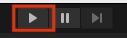

# Robotics Simulator

Welcome to the Unity Simulator project for Husky Robotics Club @ University of Washington. The purpose of this project is to build a 3D simulator based on Unity, such that the project can be ran on different OS.

We are currently implementing the functionalities from the old simulator to the new one.

## Instruction to set up simulator with mission control

1. Make sure you have Unity downloaded and installed. A more comprehensive intrudction can be found [here](https://store.unity.com/#plans-individual) form Unity.

2. Clone the repo:
   `git clone https://github.com/LuxiWang99/RoboticsSimulator.git`

3. Go to `MissionControl/client`, and run `npm start`. The command should open a browser tab with the mission control UI.

4. Go to `MissionControl/server`, and run `npm start`. This command should start the server, which will establish a connection between the client and the simulator.

5. Start the Unity project from this repo, and navigate to the MissionControl scene. After starting the simulation by clicking the 'run' button on the top of the screen, you should be able to control the little cart by using `WASD` from the mission control UI.(The broswer tab that was opened in step 3.)

   

## Troubleshooting
1. MissionControl requires a specific type of npm and node. Run `npm -version` to make sure your npm is in version `6.14.11`. Run `node --version` to makes sure it is in `v14.16.0`.
2. If the problem persists, delete `MissionControl/client/node_modules` (if it was the step 3 in the above instruction that was not working), and run `npm install`.
3. Do post an issue if the problem persists.